# ⚡ Wattly - Energy Tracking App

<div align="center">


**Modern and user-friendly energy consumption tracking application** 🔋

[Features](#-features) • [Technologies](#-technologies) • [Installation](#-installation) • [Usage](#-usage) • [Screenshots](#-screenshots) • [Contributing](#-contributing)

</div>

---

## 📱 About the App

Wattly is a comprehensive mobile application that allows users to track their daily energy consumption, manage their devices, and set energy saving goals. It's equipped with modern UI/UX design, real-time analytics, and social features.

### 🎯 Main Goals
- 📊 **Energy Consumption Tracking**: Daily, weekly, monthly, and yearly consumption analysis
- 💰 **Cost Calculation**: Estimate your energy bills
- 🌱 **Environmentally Friendly**: Track your CO2 emissions
- 🎯 **Goal Setting**: Create energy saving goals
- 👥 **Social Features**: Compare and share with friends

---

## ✨ Features

### 🔐 User Management
- ✅ **Registration and Login**: Secure Firebase Authentication
- 👤 **Profile Management**: Edit personal information
- 🔒 **Password Change**: Secure password updates
- 🔄 **Auto Login**: Persistent session management

### 📱 Main Screens
- 🏠 **Home**: General statistics and quick access
- 📊 **Dashboard**: Detailed analytics and charts
- 📋 **Device List**: View all your devices
- ➕ **Add Device**: Add and edit new devices
- 🎯 **Goals**: Energy saving goals
- 👥 **Community**: Interact with other users
- 💬 **Chat**: Message with friends

### 📈 Analytics Features
- 📊 **Real-time Charts**: Visual analysis with LineChart
- 📅 **Time Range Selection**: Daily, weekly, monthly, yearly
- 💡 **Device Type Analysis**: Heating/Cooling, Electronics, Lighting, White Goods
- 💰 **Cost Calculation**: Automatic bill estimation
- 🌍 **CO2 Tracking**: Environmental impact analysis
- 📈 **Trend Analysis**: Consumption trends

### 🔔 Notifications
- ⏰ **Daily Reminders**: Usage tracking
- ⚠️ **High Consumption Alerts**: Limit exceeded notifications
- 🎯 **Goal Reminders**: Goal tracking
- 📱 **Push Notifications**: Expo Notifications integration

### 🎨 UI/UX Features
- 🌈 **Modern Design**: Material Design 3
- ✨ **Animations**: Smooth transitions with Moti and Reanimated
- 🎭 **Gradient Effects**: Visual richness with LinearGradient
- 🌟 **Haptic Feedback**: Tactile feedback
- 🎨 **Theme Support**: Dark/Light theme
- 📱 **Responsive Design**: Compatible with all screen sizes

---

## 🛠️ Technologies

### 📱 Frontend
- **React Native** `0.79.4` - Cross-platform mobile development
- **Expo** `53.0.15` - Development platform and tools
- **React** `19.0.0` - UI library

### 🎨 UI/UX Libraries
- **React Native Paper** `5.12.5` - Material Design components
- **Moti** `0.29.0` - Animation library
- **React Native Reanimated** `3.17.4` - Performance animations
- **Lottie React Native** `7.2.2` - Vector animations
- **React Native Shadow 2** `7.1.1` - Shadow effects
- **Expo Linear Gradient** `14.0.1` - Gradient effects

### 📊 Data Visualization
- **React Native Chart Kit** `6.12.0` - Chart components
- **Victory Native** `36.6.8` - Statistical charts
- **React Native SVG** `15.11.2` - SVG support

### 🔥 Backend & Database
- **Firebase** `11.0.2` - Backend services
- **Firebase Admin** `13.0.2` - Server-side management
- **Firebase Functions** `6.2.0` - Cloud Functions

### 🔐 Authentication
- **Firebase Authentication** - User management
- **AsyncStorage** `2.1.2` - Local data storage

### 🧭 Navigation
- **React Navigation** `7.0.6` - Page transitions
- **React Navigation Stack** `7.0.0` - Stack navigation
- **React Navigation Drawer** `7.0.11` - Drawer navigation

### 📅 Helper Libraries
- **Date-fns** `4.1.0` - Date operations
- **Axios** `1.7.7` - HTTP requests
- **Expo Haptics** `14.0.0` - Tactile feedback
- **Expo Notifications** `0.31.3` - Notification management

---

## 🚀 Installation

### Prerequisites
- Node.js (v16 or higher)
- npm or yarn
- Expo CLI
- Android Studio (for Android development)
- Xcode (for iOS development)

### 1. Clone the Project
```bash
git clone https://github.com/RgpGny/Wattly-energy-tracking-app.git
cd Wattly-energy-tracking-app
```

### 2. Install Dependencies
```bash
npm install
# or
yarn install
```

### 3. Firebase Configuration
1. Create a new project in Firebase Console
2. Create a `.env` file and add your Firebase information:
```env
EXPO_PUBLIC_FIREBASE_API_KEY=your_api_key
EXPO_PUBLIC_FIREBASE_AUTH_DOMAIN=your_auth_domain
EXPO_PUBLIC_FIREBASE_PROJECT_ID=your_project_id
EXPO_PUBLIC_FIREBASE_STORAGE_BUCKET=your_storage_bucket
EXPO_PUBLIC_FIREBASE_MESSAGING_SENDER_ID=your_messaging_sender_id
EXPO_PUBLIC_FIREBASE_APP_ID=your_app_id
EXPO_PUBLIC_FIREBASE_MEASUREMENT_ID=your_measurement_id
EXPO_PUBLIC_FIREBASE_DATABASE_URL=your_database_url
```

### 4. Start the App
```bash
# With Expo CLI
expo start

# or with npm
npm start
```

### 5. Platform Selection
- **Android**: Press `a` or run `npm run android`
- **iOS**: Press `i` or run `npm run ios`
- **Web**: Press `w` or run `npm run web`

---

## 📖 Usage

### 🏠 Home Screen
- Daily energy consumption statistics
- Quick access menus
- Notification counts
- Trend indicators

### 📊 Dashboard
- Time range selection (Daily/Weekly/Monthly/Yearly)
- Detailed chart analysis
- Device type-based consumption
- Cost and CO2 calculations

### 📋 Device Management
- Add and edit devices
- Power consumption and usage time
- Device categories
- Daily usage tracking

### 🎯 Goal Setting
- Energy saving goals
- Progress tracking
- Reminders
- Success celebrations

### 👥 Social Features
- Add friends
- Messaging
- Community sharing
- Comparison tables

---

## 📱 Screenshots

### 🔐 Authentication & Welcome
<div align="center">
  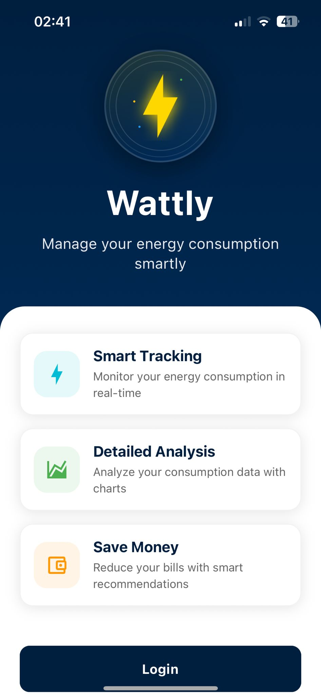
  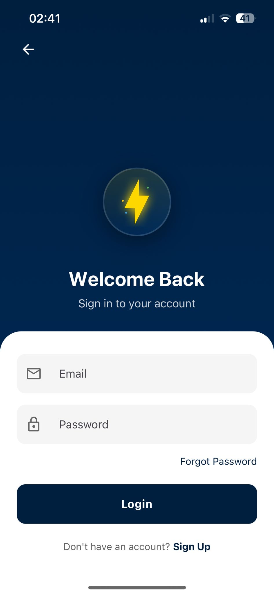
  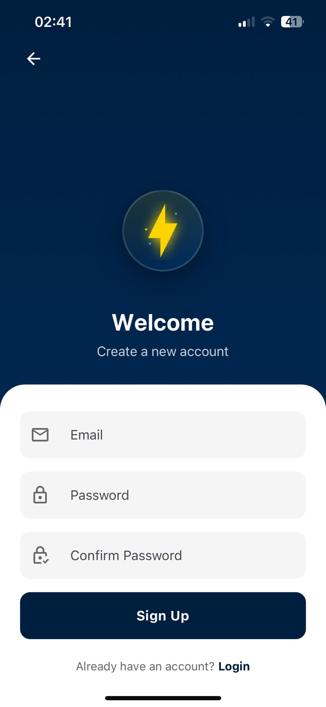
</div>

### 🏠 Main Screens
<div align="center">
  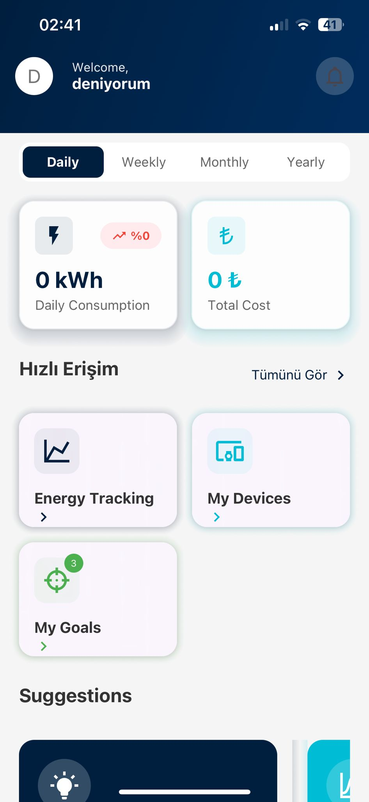
  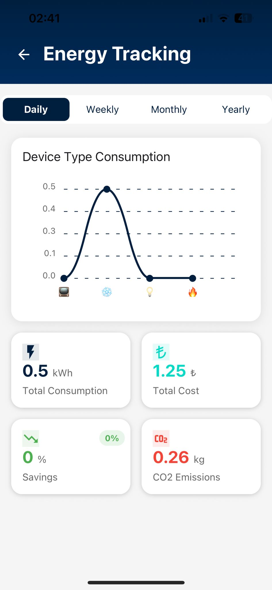
  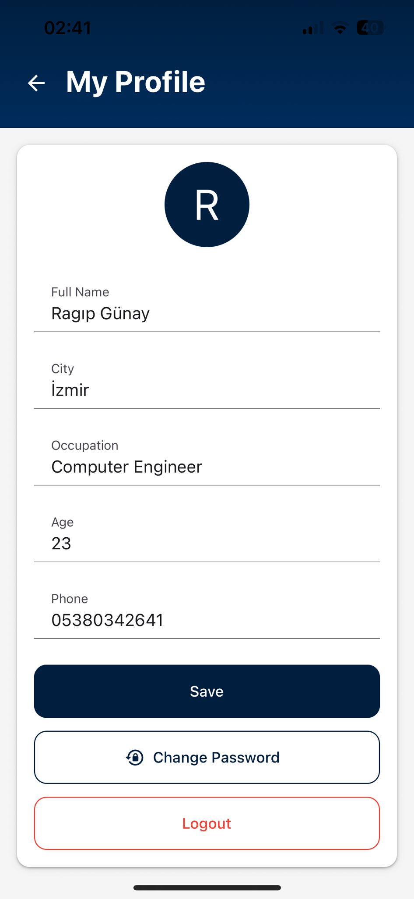
</div>

### 📱 Device Management
<div align="center">
  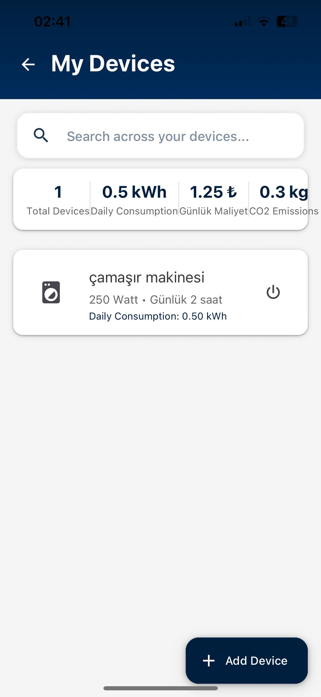
  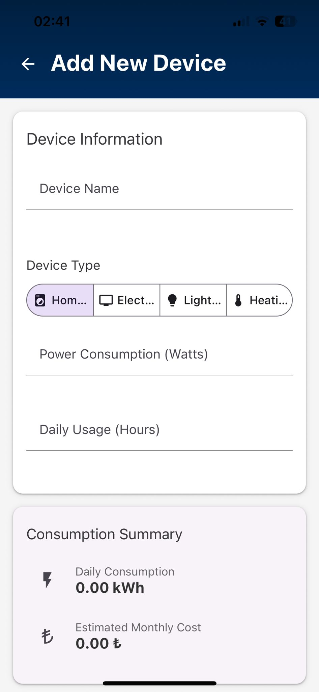
</div>

### 🎯 Goal Management
<div align="center">
  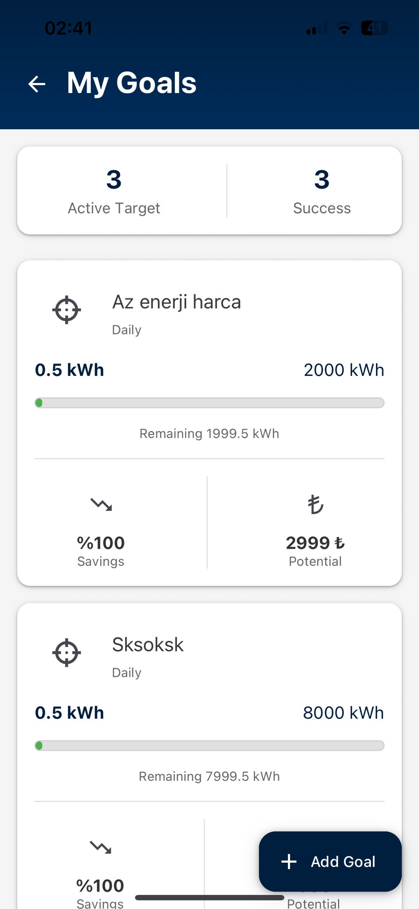
  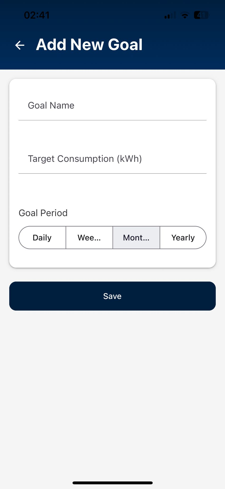
</div>

### ⚙️ Settings
<div align="center">
  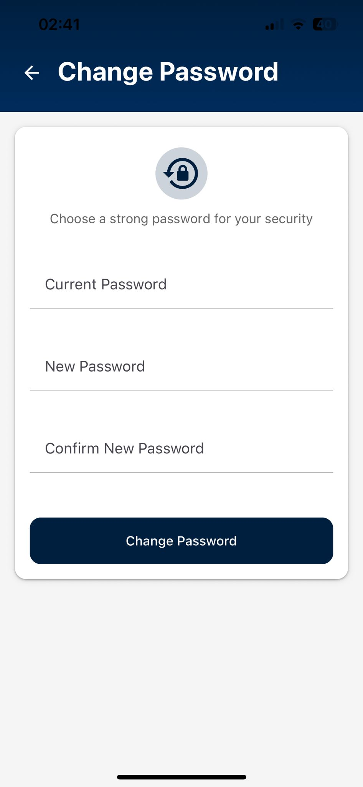
</div>

---

## 🏗️ Project Structure

```
Wattly-energy-tracking-app/
├── src/
│   ├── components/          # Reusable components
│   ├── screens/            # App screens
│   ├── services/           # API and Firebase services
│   ├── context/            # React Context
│   ├── utils/              # Helper functions
│   ├── assets/             # Images and animations
│   ├── style/              # Style files
│   └── firebaseConfig.js   # Firebase configuration
├── assets/                 # Expo assets
├── .env                    # Environment variables
├── .gitignore             # Git ignore file
└── README.md              # This file
```

---

## 🔧 Development

### Code Style
- Using ESLint and Prettier
- Component-based architecture
- Functional components and hooks
- TypeScript support (in future versions)

### Testing
```bash
# Run tests
npm test

# Coverage report
npm run test:coverage
```

### Build
```bash
# Android APK
expo build:android

# iOS IPA
expo build:ios

# Web build
expo build:web
```

---

## 🤝 Contributing

1. Fork this repository
2. Create a feature branch (`git checkout -b feature/amazing-feature`)
3. Commit your changes (`git commit -m 'Add amazing feature'`)
4. Push to the branch (`git push origin feature/amazing-feature`)
5. Create a Pull Request

### Contribution Guidelines
- Follow code standards
- Write tests
- Update README
- Write descriptive commit messages

---

## 📄 License

This project is licensed under the MIT License. See the [LICENSE](LICENSE) file for details.

---

## 👨‍💻 Developer

**Ragıp Günay**

- GitHub: [@RgpGny](https://github.com/RgpGny)
- LinkedIn: [Ragıp Günay](https://linkedin.com/in/ragipgunay)

---

## 🙏 Acknowledgments

- [Expo](https://expo.dev/) - Amazing development platform
- [Firebase](https://firebase.google.com/) - Powerful backend services
- [React Native](https://reactnative.dev/) - Cross-platform development
- [React Navigation](https://reactnavigation.org/) - Navigation solution
- [React Native Paper](https://callstack.github.io/react-native-paper/) - UI components

---

<div align="center">

⭐ Don't forget to star this project if you liked it!

[View on GitHub](https://github.com/RgpGny/Wattly-energy-tracking-app)

</div> 